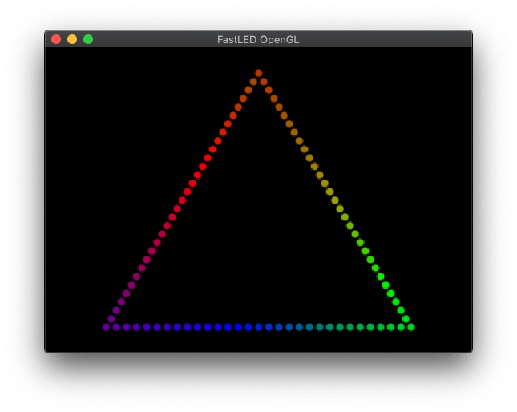

# FastLED-OpenGL

Provides a way to simulate addressable LEDs with [OpenGL](https://www.opengl.org/) using [FastLED](https://github.com/FastLED/FastLED). This is a still from the animation created in [triangle.cpp](examples/triangle.cpp):

This was used in [GeoLEDic](https://github.com/samsta/GeoLEDic) and I've broken it out into a separate repository, but very soon I realised that I couldn't bring up the time to keep it generic, and GeoLEDic diverged. I'm keeping this repo here in case it might be useful to someone else. 

See the [cmake workflow](.github/workflows/cmake.yml) for an idea how to build it. Good luck!

Status: very early stage...

~~~
sudo apt-get install cmake libglfw3-dev libglew-dev libglm-dev
~~~

or on Mac ([homewbrew](https://brew.sh) required)

~~~
brew install cmake glfw glm
~~~

## Keystrokes

- Arrow left/right: strafe left, right
- Arrow up/down: move up, down
- Shift-0 to Shift-9: select view 0 to 9 from the list of Config::View passed into the constructor
- Shift-M: toggle full mouse control, see below. Off at startup
- Shift-Q: quit

Any keys that aren't handled are passed on to Config::KeyboardHandler if one was registered.
Note that the keys are represented by uppercase characters always.

## Mouse Control

Zoom in and out using the scroll wheel.

If full mouse control is enabled with Shift-M, the mouse cursor disappears and you can look around by moving the mouse
